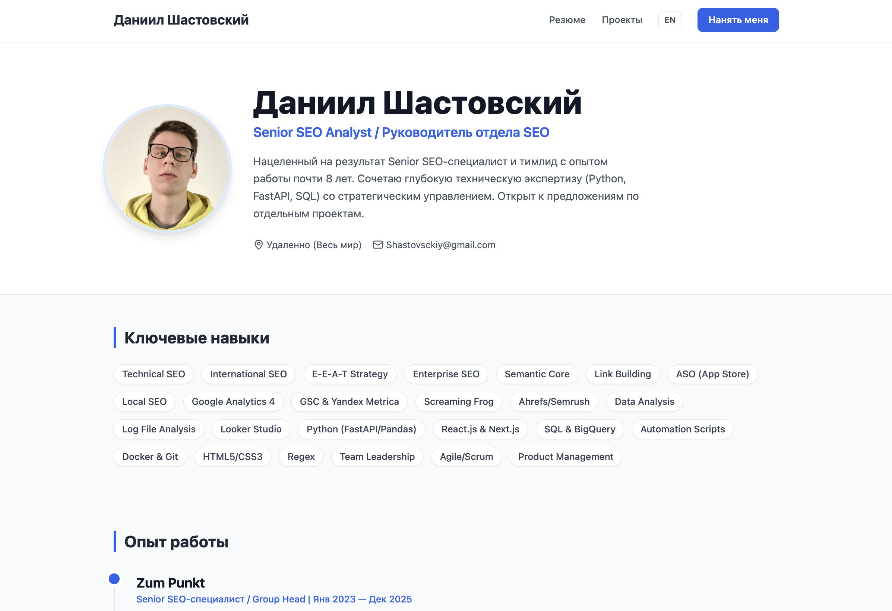

# 🚀 SEO-Friendly Developer Portfolio Template

A modern, high-performance **Single Page Application (SPA)** portfolio template built with React and Vite. 
Designed for Developers and SEO Specialists who need a fast, responsive, and search-engine-friendly resume website.

> **Live Demo:** [seo.shastovsky.ru](https://seo.shastovsky.ru) *(Replace with your link)*

---

## ✨ Key Features

*   **⚡ Blazing Fast:** Built with [Vite](https://vitejs.dev/) for instant server start and lightning-fast HMR.
*   **🔍 SEO Optimized:** Fully configured `<head>` management using `react-helmet-async`. Includes:
    *   Dynamic Title & Meta Descriptions.
    *   Open Graph (OG) tags for social media sharing.
    *   `hreflang` support for multi-language SEO.
    *   JSON-LD Structured Data (Schema.org) for Rich Snippets.
*   **🌍 Multi-Language (i18n):** Native support for **English** and **Russian** content (easily extensible).
*   **📱 Fully Responsive:** Mobile-first design using **Tailwind CSS**.
*   **🎨 Data-Driven Content:** All content (text, projects, experience) is separated into a single `data.js` file. No need to dig into components to update your info.
*   **🛠 Clean Architecture:** Component-based structure with reusable UI elements.

---

## 🛠 Tech Stack

*   **Core:** React 19, Vite
*   **Styling:** Tailwind CSS, PostCSS
*   **Routing:** React Router DOM v7
*   **SEO:** React Helmet Async
*   **Icons:** Lucide React
*   **Animation:** Native CSS animations & transitions

---

## 📸 Screenshots

---

## 🚀 Getting Started

### 1. Clone the repository

git clone https://github.com/your-username/seo-portfolio.git
cd seo-portfolio
### 2. Install dependencies
code
Bash
npm install
### 3. Run development server
code
Bash
npm run dev
Open http://localhost:5173 in your browser.

## ⚙️ Configuration & Customization
### 1. Update Content
Edit src/data.js. This file contains all the text, projects, and personal info.
code
JavaScript
export const personalInfo = {
  name: "Your Name",
  title: "Your Job Title",
  // ...
};

export const content = {
  en: { ... }, // English content
  ru: { ... }  // Russian content
};
### 2. Update Images
Place your images in public/assets/.
Avatar: public/assets/images/avatar_default.webp
Project logos: public/assets/portfolio/...
### 3. Configure SEO Domain
Go to src/SeoHead.jsx and update the DOMAIN constant to ensure canonical and hreflang tags work correctly.
code
JavaScript
const DOMAIN = 'https://your-domain.com';
## 📦 Deployment
Nginx (VPS)
Build the project:
code
Bash
npm run build
Upload the dist folder to your server (e.g., /var/www/portfolio).
Configure Nginx to handle SPA routing (redirect 404 to index.html):
code
Nginx
server {
    listen 80;
    server_name your-domain.com;
    root /var/www/portfolio;
    index index.html;

    location / {
        try_files $uri $uri/ /index.html;
    }
}
Vercel / Netlify
Just connect your GitHub repository, and it will auto-detect the Vite settings.
## 🤝 Contributing
Contributions, issues, and feature requests are welcome!
Feel free to check issues page.
## 📝 License
This project is MIT licensed. You are free to use it as a template for your own portfolio.

Made with ❤️ by Dan1elShastovscky